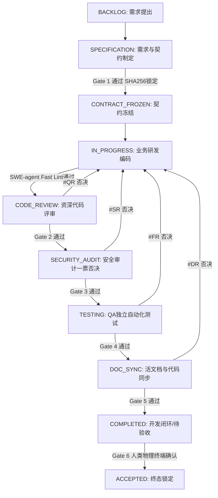

# Standard Operating Procedure: 标准功能特性研发闭环 (Feature Delivery SOP)

本 SOP 适用于 Tier 2 (CORE) 与 Tier 3 (ENTERPRISE) 级别的标准软件功能交付。

---

## 阶段流程总览 (Lifecycle Stages)



---

## 详细步骤执行清单

### 步骤 1: 需求建单与工时评估 (PMO)
1. 需求分析师分析用户诉求，评估是否满足单一职责原则（$\le 8.0\text{h}$）。
2. 产出 `docs/specs/REQ-xxxx.md`。
3. 执行建单：
   ```bash
   python tools/vc_cli.py create --id TSK-xxxx --title "<特性名称>" --tier 2 --hours 4.0 --assignee pm
   ```

### 步骤 2: 架构设计与契约冻结 (Architect)
1. 架构师制定 `docs/contracts/SPEC-xxxx.json` 与 `docs/adr/ADR-xxxx.md`。
2. 架构师只读 `src/`，不得编写业务代码。
3. 校验并冻结 Gate 1：
   ```bash
   python tools/vc_cli.py gate-check --id TSK-xxxx --gate gate_1_contract --file docs/contracts/SPEC-xxxx.json
   python tools/vc_cli.py advance --id TSK-xxxx --stage CONTRACT_FROZEN --role architect
   ```

### 步骤 3: 隔离分支实现与代码快筛 (Developer)
1. 开发者领单并启动任务：
   ```bash
   python tools/vc_cli.py start --id TSK-xxxx --role developer
   ```
2. 开发者依据契约在 `src/` 编码，严禁篡改 `tests/`。
3. 编写完成后执行快速 AST 语法自测：
   ```bash
   python tools/vc_cli.py lint --target src/
   ```
4. 推进至代码评审阶段：
   ```bash
   python tools/vc_cli.py advance --id TSK-xxxx --stage CODE_REVIEW --role developer
   ```

### 步骤 4: 代码评审与规范检查 (Code Reviewer)
1. 审查代码坏味道与圈复杂度。
2. 校验 Gate 2：
   ```bash
   python tools/vc_cli.py gate-check --id TSK-xxxx --gate gate_2_review --commit-msg "feat(core): implement feature"
   ```
3. 若不合格，使用 `#QR` 一票否决；若合格，推进至安全审计：
   ```bash
   python tools/vc_cli.py advance --id TSK-xxxx --stage SECURITY_AUDIT --role code_reviewer
   ```

### 步骤 5: 安全扫描与渗透检测 (Security Engineer)
1. 扫描硬编码密钥与 OWASP 漏洞。
2. 校验 Gate 3：
   ```bash
   python tools/vc_cli.py gate-check --id TSK-xxxx --gate gate_3_security
   ```
3. 若发现安全隐患，使用 `#SR` 坚决打回；若通过，推进至 QA 测试：
   ```bash
   python tools/vc_cli.py advance --id TSK-xxxx --stage TESTING --role security_engineer
   ```

### 步骤 6: 独立自动化测试与覆盖率验证 (QA Engineer)
1. QA 工程师在 `tests/` 独立编写测试用例。
2. 运行自动化测试：
   ```bash
   python tools/vc_cli.py gate-check --id TSK-xxxx --gate gate_4_testing
   ```
3. 若测试失败，使用 `#FR` 打回；通过后推进至文档同步：
   ```bash
   python tools/vc_cli.py advance --id TSK-xxxx --stage DOC_SYNC --role qa_engineer
   ```

### 步骤 7: 活文档同步与交付封装 (Doc & Release Engineer)
1. 校验代码变更与 API 文档的一致性：
   ```bash
   python tools/vc_cli.py gate-check --id TSK-xxxx --gate gate_5_doc_sync
   ```
2. 刷新 AST Repo Map：`python tools/vc_cli.py repomap`。
3. 发布工程师推进至待验收：
   ```bash
   python tools/vc_cli.py advance --id TSK-xxxx --stage COMPLETED --role release_engineer
   ```

### 步骤 8: 人类最终物理验收 (Human Gate 6)
1. 人类操作员在交互终端上审查交付物及收据：
   ```bash
   python tools/vc_cli.py status --id TSK-xxxx
   python tools/vc_cli.py accept --id TSK-xxxx
   ```
2. 输入 `y` 确认，工单进入不可逆的终态 `ACCEPTED`。
